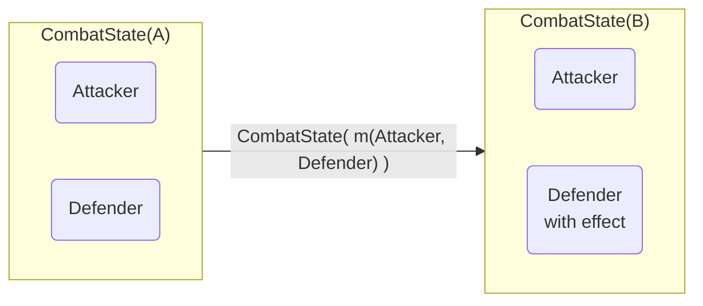

# Pokemon Orientate to Categories

In this article, I will try to explain how to model the Pokemon behavior in categories, types, functors, functions and other concepts of category theory.

Nowadays, all people know Pokemon and the programer community is not an exception, so they have created a lot of explications about how to model the Pokemon behavior in OOP, and this is a good way to understand the concepts of OOP with a simple example. But, the same way, we can model the Pokemon behavior in categories theory concepts, using languages like Haskell, Scala, F#, etc.

For this article, I will use the Haskell language, however, this you can be applied to other languages (inclusing the OOP languages like Python, JS, etc).

## Pokemon

First, we need to define the Pokemon type, and for this, we will use the following data type:

```haskell
data Pokemon = Pokemon
  { namePokemon :: String,
    typePokemon :: Type, -- type is a reserved word in Haskell
    healthPoints :: Int,
    attack :: Int,
    defense :: Int,
    speed :: Int,
    movements :: [Movement]
  }
```

Now, we need to define the Pokemon type, and for this, we will use the following data type:

```haskell
data Type
  = Fire
  | Water
  | Grass
  | Electric
  | Normal
  deriving (Show, Eq)
```

In OOP, we can define the Pokemon type as a class, and the Type as an enum, but in Haskell, we can define the Pokemon type as a record, and the Type as a sum type.

Also, we need to define the Movement type, and for this, we will use the following data type:

```haskell
data Movement = Movement
  { nameMovement :: String,
    typeMovement :: Type,
    power :: Int,
    accuracy :: Int,
    effect :: Movement -> Pokemon -> Pokemon -> Pokemon
  }
```

The Movement type is a record, and the effect is a function that takes a Movement, two Pokemons and returns a with the effect of the movement.

## Pokemon Categories

In Categories theory, we can define the categories as a set of objects and a set of morphisms between objects. In this case, we can define the objects as the Pokemon type, and the morphisms as the attacks. So, for represent the changes in the state of the combat, we can use a functor. The functor is a mapping between categories, and in this case, we can create a type and build a functor to represent the changes in the state of the combat.

```haskell
data CombatState attacker defender = CombatState attacker defender
```

In Haskell, we use the instance keyword to create a type class instance, and for this, we need to create a Functor instance for the CombatState type.

> Typeclass instances are a way to extend the functionality of existing types. Here, we create a type of kind Functor, which is a typeclass that defines a single function fmap.

```haskell
instance Functor (CombatState a) where
  fmap m (CombatState f1 f2) = CombatState f1 (m f2)
```

Using fmap (Functor mapping), we using the this function to apply the effect `m` to attack the fighter `f2`.

It is possible to visualize this with something like this:


